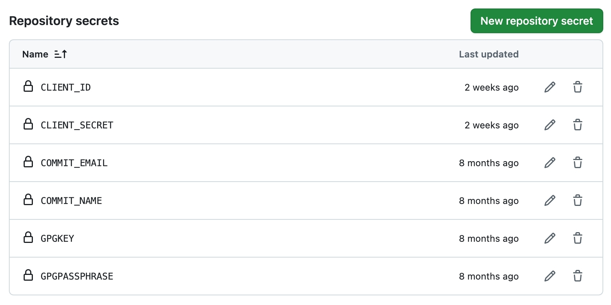
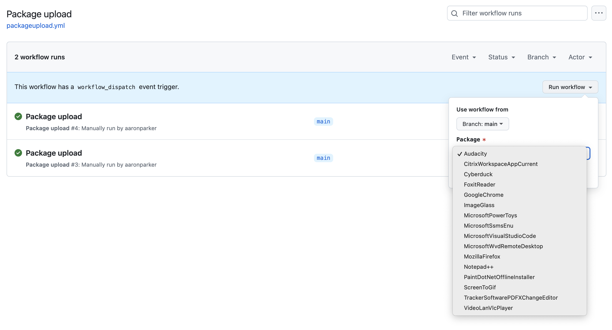

# Rimo3

Evergreen and Rimo3 Cloud integration solution.

## Update Secrets

Add the required secrets to the repository to enable the `Start-PackageUpload.ps1` script to authenticate to the Rimo3 API:

* `CLIENT_ID` - Authentication client ID
* `CLIENT_SECRET` - secret value to authenticate with the client ID

The following secrets are used by the `update-packagejson` workflow to sign git commits:

* `COMMIT_EMAIL` - Email address used for commits
* `COMMIT_NAME` - Display name used for commits
* `GPGKEY` - Signing key for commits
* `GPGPASSPHRASE` - Passphrase used to unlock the key during commits

## Run workflow

The GitHub Actions workflow can be started from the Actions tab. This runs `Start-PackageUpload.ps1` and will import the package selected from the dropdown menu.

## Manually test apps

`New-LocalPackage.ps1` can be used to create packages with PSADT and application binaries for local testing before import into Rimo3 Cloud.
