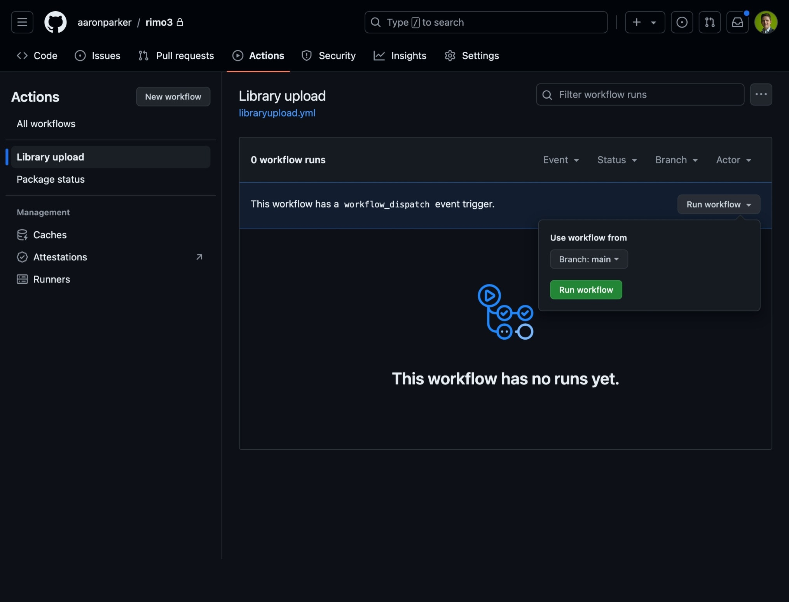

# Rimo3

Evergreen and Rimo3 Cloud integration proof-of-concept.

## Update Secrets

Add the required secrets to the repository:

* `CLIENT_ID` - Okta client ID
* `CLIENT_SECRET` - secret value to authenticate with the client ID
* `OKTA_STUB` - the stub value used in the Okta authentication URL, e.g. `aus44lpmxba6Mxq8M4z7`

## Run workflow

The GitHub Actions workflow can be starts on the Actions tab. This runs `Start-PackageLibraryUpload.ps1` and will import the packages defined in the `Library1` directory.

## Manually test apps

`New-LocalPackage.ps1` can be used to create packages with PSADT and application binaries for local testing before import into Rimo3 Cloud.
