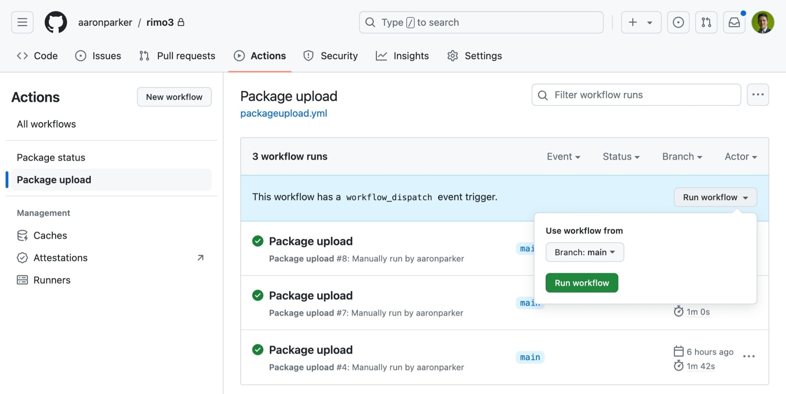
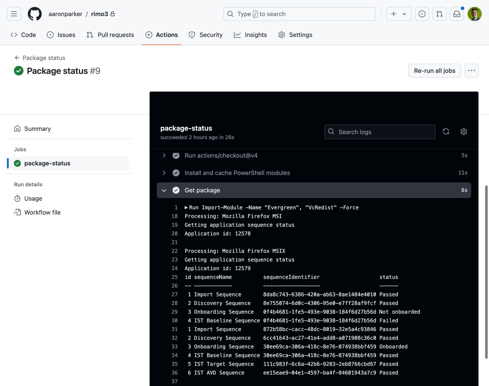

# Rimo3

Evergreen and Rimo3 Cloud integration proof-of-concept.

## Import packages

Packages can be uploaded via the `Package upload` workflow:

## View package status

Package status from Rimo3 Cloud can be output via the `Package status` workflow:

